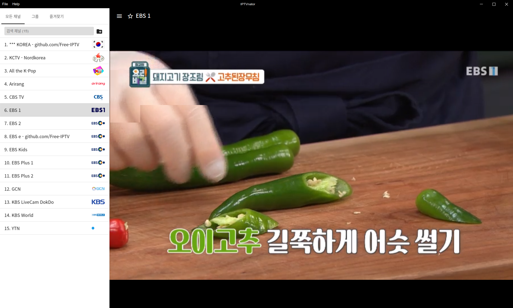
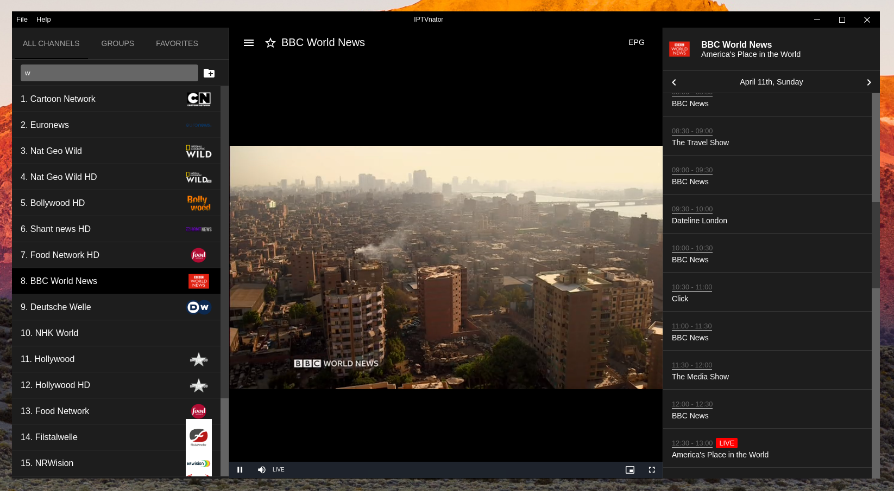
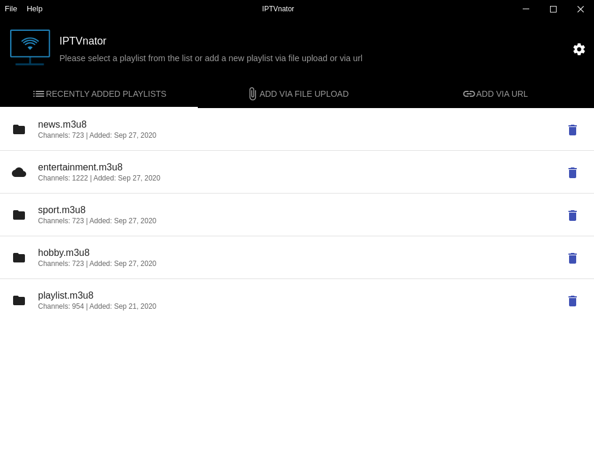
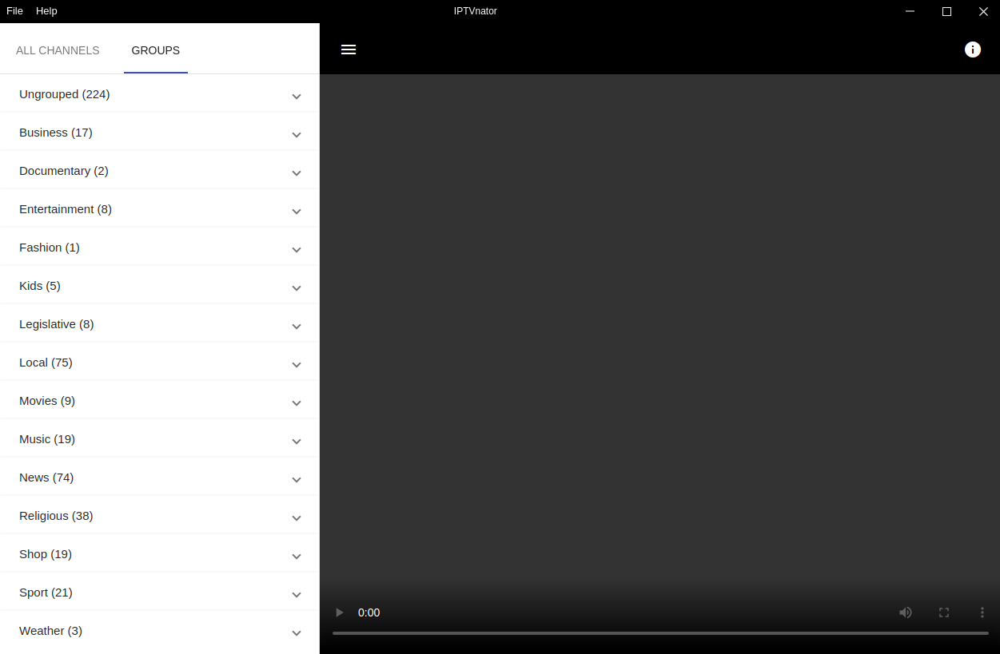
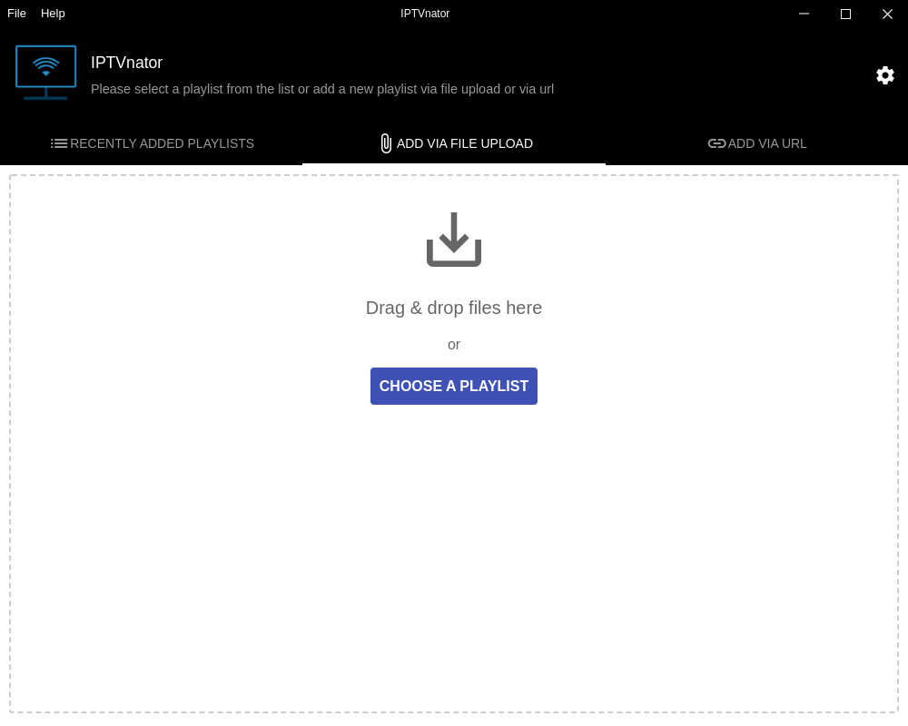
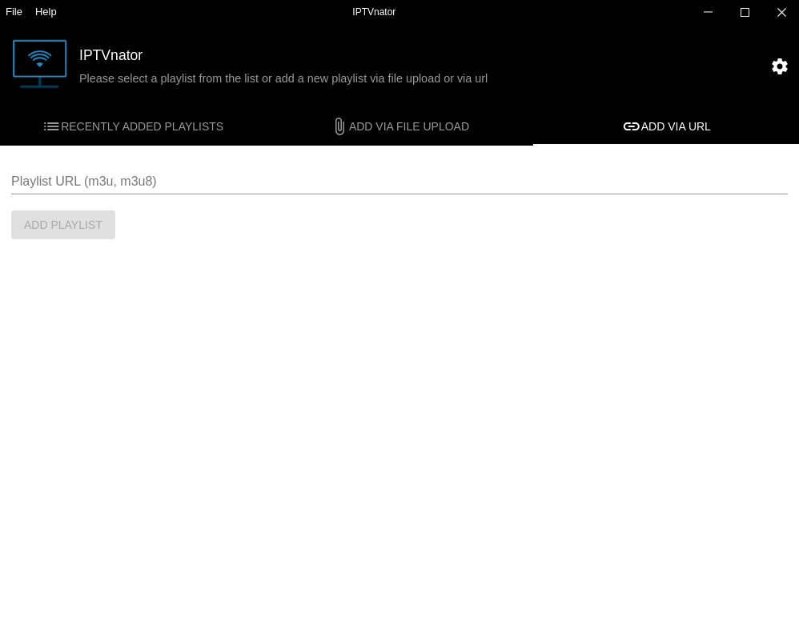
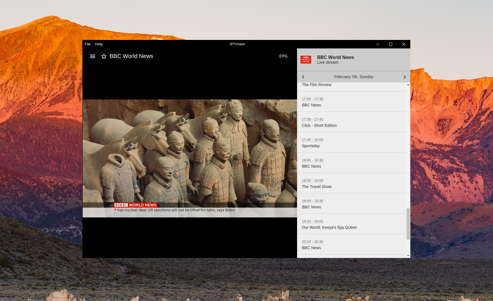
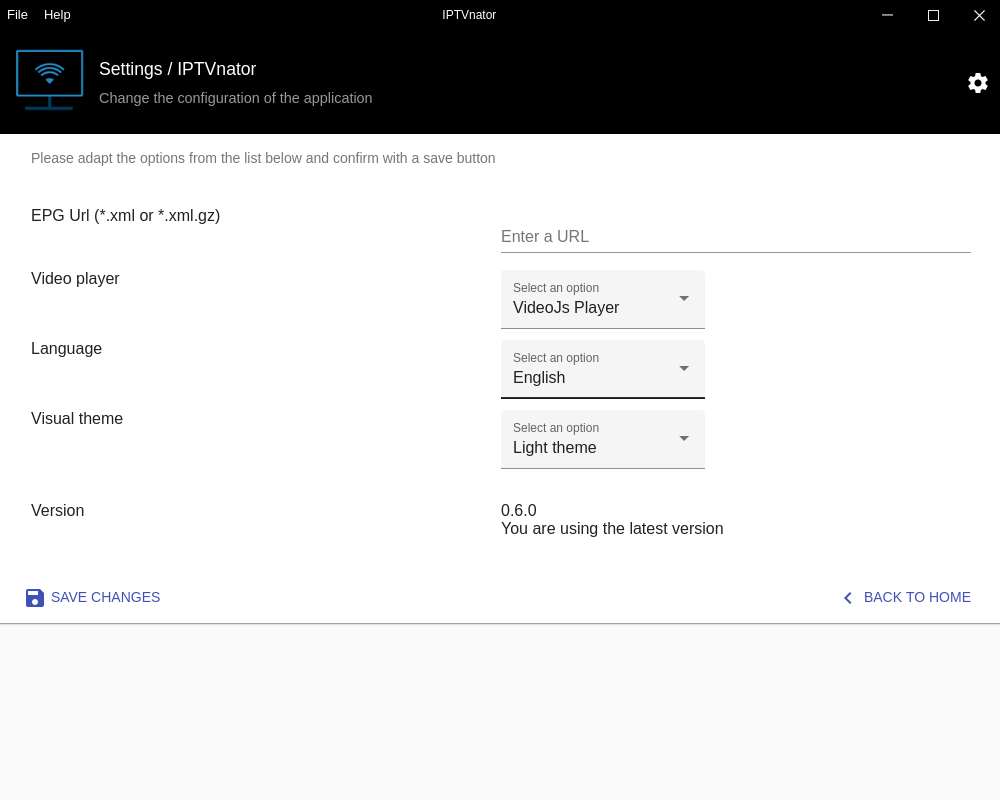
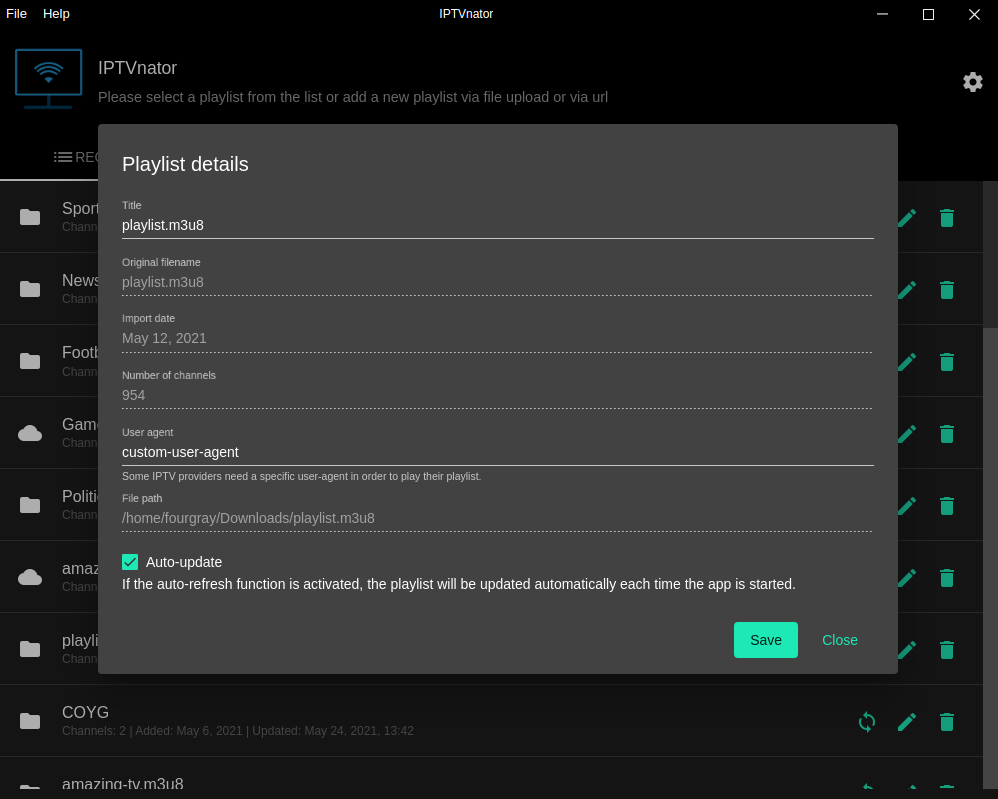

# IPTVnator

IPTV 를 볼 수 있는 프로그램입니다. 

채널 파일을 다운로드 해야 TV를 볼 수 있습니다. 아래 링크에서 채널 파일을 다운로드 하세요.

 * IPTV 채널 파일 : https://github.com/Free-IPTV/Countries
 * 전세계 무료채널(m3u) 압축 파일 : [free_iptv_m3u.zip](./free_iptv_m3u.zip)



# Install

## HamoniKR (>= 3.0)
```
sudo apt update
sudo apt install iptvnator
```

## Other Ubuntu based distro
```
# add hamonikr apt repo
wget -qO- https://pkg.hamonikr.org/add-hamonikr.apt | sudo -E bash -

# install
sudo apt install iptvnator
```

 * upstream : https://github.com/4gray/iptvnator

**IPTVnator** is a video player application that provides support for the playback of IPTV playlists (m3u, m3u8). The application allows to import playlists by using remote URLs or per file upload from the file system. Additionally there is a support of EPG information XMLTV-based which can be provided by URL.

The application is an cross-platform and open source project based on Electron and Angular.



## Features

- M3u and M3u8 playlists support 📺
- Upload playlists from a file system 📂
- Add remote playlists via URL 🔗
- Playlists auto-update feature
- Open playlist from the file system
- Search for channels 🔍
- EPG support (TV Guide) with detailed info
- TV archive/catchup/timeshift
- Group-based channels list
- Save channels as favorites
- HTML video player with hls.js support or Video.js based player
- Internalization, currently 3 languages are supported (en, ru, de)
- Set custom "User Agent" header for a playlist
- Light and Dark theme

## Screenshots:

| Welcome screen: Playlists overview                           | Main player interface with channels sidebar and video player                |
| :----------------------------------------------------------: | :-------------------------------------------------------: |
|        |  |
| Welcome screen: Add playlist via file upload                | Welcome screen: Add playlist via URL                      |
|  |              |
| EPG Sidebar: TV guide on the right side                | General application settings
|  |  |
| Playlist settings                |
|  |  |

*Note: First version of the application which was developed as a PWA is available in an extra git branch.*


## How to build

Requirements: node.js with npm.

1. Clone this repository and install all project dependencies with:
   ```
   $ npm install
   ```

2. To build the application on your local machine use one of the following commands:
   ```
   # linux
   $ npm run electron:build:linux
   ```

   ```
   #mac
   $ npm run electron:build:mac
   ```

   ```
   # windows
   $ npm run electron:build:windows
   ```

